# 奈落塔 プロジェクト解説書

更新日: 2026-07-30  
対象: `NarakuProto` リポジトリ  
主対象シーン: `SceneNarakuProto`

## 1. この文書の目的

この文書は、ゲーム「奈落塔」の企画意図と、現在のプロトタイプを構成するコード設計をまとめたものです。

主に次の内容を扱います。

- 何を検証するためのプロトタイプなのか
- どのファイルが何を担当しているのか
- データがどのように編集、生成、検証、実行されるのか
- どのような設計パターンを使っているのか
- 1フレームの更新、潜行、採掘、帰還、層間移動がどう処理されるのか
- 現在の設計上の強みと、製品化へ向けて残っている課題

企画上の詳細は [企画草案.md](企画草案.md)、操作方法は [操作概要.md](操作概要.md)、地形Editorの使い方は [地形エディタ機能紹介と使い方.md](地形エディタ機能紹介と使い方.md) も参照してください。

## 2. プロジェクト概要

### 2.1 ゲームの基本コンセプト

「奈落塔」は、深く潜るほど大きな利益を得られる一方、帰還の危険も増していく、2.5D探索サバイバルローグライトです。

- 仮タイトル: 奈落塔
- キャッチコピー: 帰ってくるまでが遠足
- 中心判断: まだ潜るか、もう帰るか
- 主なリスク: 体力、精神力、スタミナ、重量、敵、落下、上昇負荷
- 主な報酬: 旧器、食料、地図情報、装備購入につながる資源

ゲームの中心は、単に最深部へ到達することではなく、得たものを失わずに持ち帰る判断にあります。

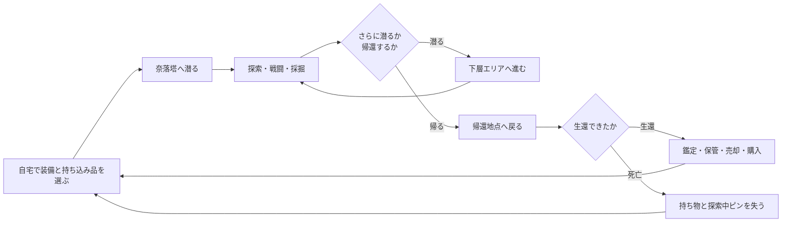

### 2.2 プロトタイプで確認していること

現在の実装は、完成版の全要素を作ることより、次のゲーム体験が成立するかを確認することを優先しています。

1. 探索して旧器を見つける。
2. 重量と残りリソースを見ながら、取得するか判断する。
3. 深く潜るほど帰還負荷が増える。
4. 生還すれば旧器を鑑定、保管、売却できる。
5. 死亡すれば潜行中の成果を失う。
6. 得た資源で装備や次回の持ち込みを整える。

このため、コントローラー対応、進行状況のファイル保存、第二層以降の固有環境、依頼、旧器加工などは現在のプロトタイプ範囲外です。

## 3. 技術構成

| 項目 | 内容 |
| --- | --- |
| 言語 | C++ |
| 対象OS | Windows |
| グラフィックス | DirectX 11 |
| UI・デバッグ操作 | Dear ImGui |
| 数学処理 | DirectXMath |
| 3Dモデル | 独自ラッパーとAssimpを利用する既存基盤 |
| データ形式 | JSON |
| ビルド | Visual Studio 2022相当、MSVC v143、Windows SDK 10.0 |
| 主な構成 | Win32アプリケーション、シーン管理方式 |

Debug x64はリポジトリ直下で次のコマンドからビルドできます。

```powershell
powershell -ExecutionPolicy Bypass -File .\build_debug_x64.ps1
```

`Assets/...` の相対パスを使うため、実行時の作業ディレクトリは通常 `DX22_Project` を想定しています。

## 4. 全体アーキテクチャ

既存のDirectXゲーム基盤へ「奈落塔」を独立シーンとして追加し、その内部に編集、生成、検証、実行用のデータ経路を作っています。

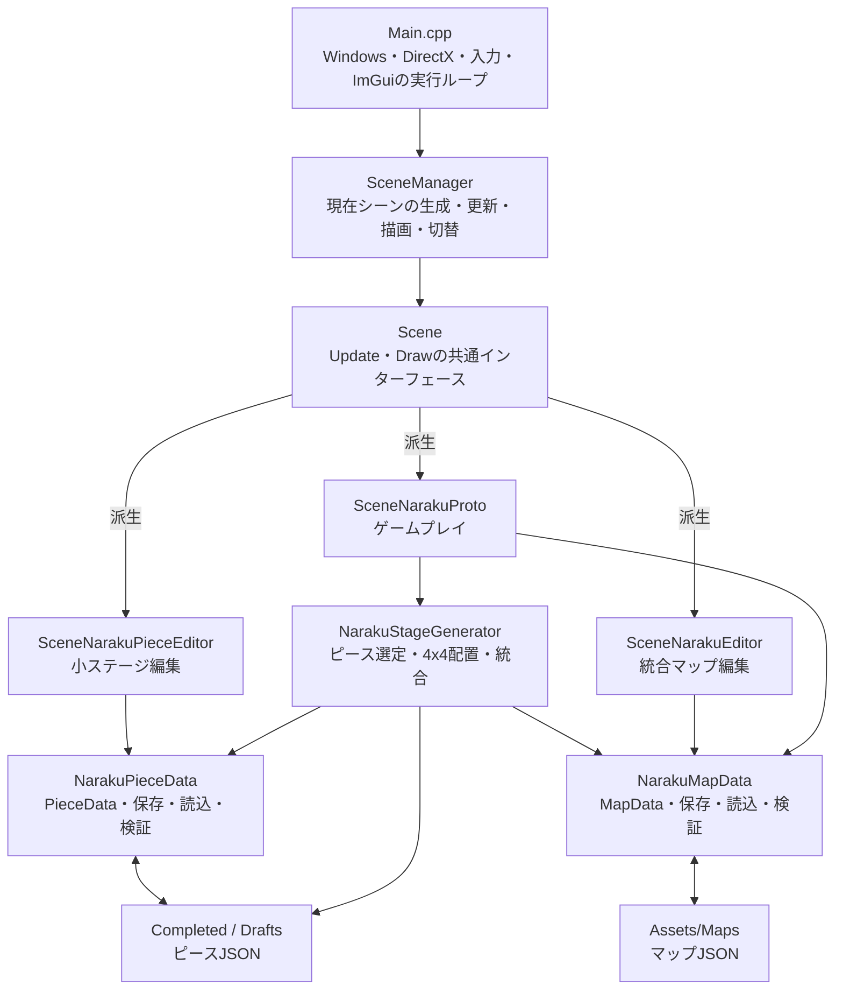

### 4.1 レイヤーごとの責務

| レイヤー | 主なファイル | 責務 |
| --- | --- | --- |
| アプリケーション基盤 | `Main.cpp`、`Startup.cpp` | Windows、DirectX、入力、ImGui、メインループ |
| シーン制御 | `Scene.h/.cpp`、`SceneManager.h/.cpp` | シーンの共通API、生成、切替、更新、描画 |
| ゲーム実行 | `SceneNarakuProto.h/.cpp` | 潜行、移動、戦闘、採掘、帰還、拠点、描画 |
| 小ステージ編集 | `SceneNarakuPieceEditor.h/.cpp` | ピースの地形・属性・オブジェクト編集、完成保存 |
| 統合マップ編集 | `SceneNarakuEditor.h/.cpp` | マップ全体の地形レイヤーや配置物編集 |
| ピースデータ | `NarakuPieceData.h/.cpp` | `PieceData`、JSON保存・読込、入力検証、パス処理 |
| 自動生成 | `NarakuStageGenerator.h/.cpp` | 完成ピースの列挙、分類、接続、統合、検証、保存 |
| マップデータ | `NarakuMapData.h/.cpp` | `MapData`、JSON保存・読込、到達可能性を含む検証 |
| 描画基盤 | `Shader`、`MeshBuffer`、`Model`、`Texture` など | GPUリソースと描画命令のラップ |

### 4.2 奈落塔以外のコードとの関係

リポジトリには、元になったゲーム基盤のタイトル、ゲーム、ボスEditorなども含まれています。奈落塔の実行に直接関係する中心は `SCENE_NARAKU_PROTO` で、`SceneManager::Init()` は現在このシーンを初期シーンとして生成します。

奈落塔関連コードを独立シーンに閉じ込めたことで、既存基盤を大きく改造せず、プロトタイプを追加できる構造になっています。

## 5. 主要データモデル

### 5.1 `PieceData`

`NarakuPiece::PieceData` は、マップ生成へ投入する1個の小ステージを表します。

主な内容は次の通りです。

- ID、表示名、更新日時、所属階層
- グリッドサイズ、セルサイズ、頂点の高さ
- 歩行、ロープ、採掘、敵候補、削除状態などのセル属性
- 北・南・東・西の接続カテゴリ
- 層内ロープ
- 層入口・層出口
- 採掘ポイント
- 環境オブジェクト
- 開始・帰還地点候補

小ステージEditorは下書きを `Drafts`、生成へ使用できる完成データを `Completed` に保存します。完成保存時だけ検証エラーを保存ゲートとして扱います。

### 5.2 `MapData`

`NarakuMap::MapData` は、ゲーム実行に使う統合済みエリアを表します。

- 複数の `TerrainLayer`
- 層内ロープ
- 採掘ポイント
- 層間口
- 環境オブジェクト
- プレイヤー開始地点
- 帰還地点
- 自動落下を始める高低差
- 生成元ピース名

### 5.3 編集データから実行データへの変換

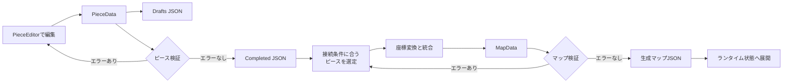

`PieceData` と `MapData` を分けることで、「人が再利用可能な部品として編集する形式」と「ゲームが1エリアとして消費する形式」を分離しています。

## 6. 設計思想

### 6.1 既存基盤を壊さず、独立シーンとして追加する

奈落塔固有の処理は主に `SceneNarakuProto` へ置かれています。既存のDirectX初期化、入力、テクスチャ、モデル、ImGuiを再利用し、ゲームルールの検証へ時間を使う判断です。

### 6.2 データ駆動で地形を作る

地形をC++へ直接書くのではなく、小ステージをJSONで保存し、実行時に組み合わせます。

これにより、次の役割が分かれます。

- デザイナー: ピースを編集する
- 生成器: 接続可能なピースを選ぶ
- 検証器: データの破綻を検出する
- ランタイム: 完成した `MapData` をゲーム状態へ変換する

### 6.3 壊れたデータを実行段階へ進めない

検証は2段階あります。

1. 完成ピース保存前の `ValidatePieceData`
2. 生成マップ保存前の `ValidateMapData`

形式上の整合性だけでなく、開始地点から帰還地点へ到達できるかも確認します。

### 6.4 生成と潜行中の状態保持を分ける

エリアへ初めて入る時だけマップを生成し、その後は `AreaState` に敵、採掘状態、ドロップ、地図ピンなどを保持します。同じエリアへ戻っても再生成しないため、プレイヤーの行動結果が潜行中は維持されます。

### 6.5 描画回数をデータ量から切り離す

地形セルや敵を1個ずつ描画するのではなく、頂点を動的バッファへまとめて描画します。4x4・各16x16頂点の最大構成では、地形床は最大3,600セルありますが、床描画を1回へまとめる設計です。

## 7. 使用しているデザインパターン

この章では、コード上で明確に確認できるものを「採用」、厳密なGoF実装ではないものを「〜に近い構造」として区別します。

| パターン・考え方 | 判定 | 主な場所 | 目的 |
| --- | --- | --- | --- |
| State | 採用 | `SceneManager`、`SceneNarakuProto::Mode` | シーンやゲームモードごとに処理を切り替える |
| Template Method / Polymorphism | 小規模に採用 | `Scene::RootUpdate/RootDraw` と派生クラス | 共通入口から派生シーンの処理を呼ぶ |
| Simple Factory | 採用 | `SceneManager::CreateScene` | 列挙値から具体的なシーンを生成する |
| Memento | 採用 | 両Editorの `EditorSnapshot` | 編集状態を保存してUndo/Redoする |
| DTO | 採用 | `PieceData`、`MapData` | 処理から独立した保存・受け渡しデータを表す |
| Facade | 近い構造 | `NarakuPiece`、`NarakuMap` 名前空間API | 保存、読込、検証、パス処理の入口をまとめる |
| Processing Pipeline | 採用 | ピース編集からマップ実行まで | 工程ごとにデータを変換、検証する |
| Builder | 近い構造 | `GenerateFixedGridMap` | 複数工程で `MapData` を段階的に構築する |
| Batch Rendering | 採用 | 地形床・敵ビルボード描画 | ドローコールとバッファ更新回数を減らす |

### 7.1 Stateパターン

#### アプリケーション全体

`SceneManager` は現在の `Scene` を1つ保持し、`SceneType` に応じてタイトル、各Editor、奈落塔プロトタイプなどを切り替えます。

#### 奈落塔シーン内部

`SceneNarakuProto::Mode` は、次の状態を明示的に表します。

- `Explore`
- `Inventory`
- `RelicPrompt`
- `ReturnConfirm`
- `ReturnResult`
- `DeathResult`
- `Home`
- `GeneralShop`
- `Armory`
- `Loading`
- `LayerTransition`

状態ごとに受け付ける入力、進める更新、重ねるUIが変わります。たとえば `Loading` と `LayerTransition` 中は通常探索の更新を止め、専用処理だけを進めます。

利点は、不正な同時操作を抑えやすく、現在何を表示・更新すべきかを列挙値から判断できることです。一方、各状態の実装自体は同じ巨大クラスにあるため、状態クラスへ完全分離したGoFのStateパターンではありません。

### 7.2 Template Methodとポリモーフィズム

基底クラス `Scene` は `Update()` と `Draw()` を純粋仮想関数として定義し、`RootUpdate()` と `RootDraw()` が派生クラスの実装を呼びます。

```mermaid
sequenceDiagram
    participant Loop as Mainループ
    participant Manager as SceneManager
    participant Base as Scene
    participant Concrete as SceneNarakuProto

    Loop->>Manager: Update()
    Manager->>Base: RootUpdate()
    Base->>Concrete: Update()
    Loop->>Manager: Draw()
    Manager->>Base: RootDraw()
    Base->>Concrete: Draw()
```

現状のルート関数は委譲だけですが、シーン共通の前処理・後処理を追加する場所として使えます。

### 7.3 Simple Factory

`SceneManager::CreateScene(SceneType)` は `switch` で具象シーンを `new` します。独立したFactoryクラスはありませんが、生成判断を呼び出し元から隠しているためSimple Factoryに該当します。

なお、`SceneManager` は全メンバーがstaticな管理クラスです。インスタンスを1個だけ生成するSingletonパターンとは異なります。

### 7.4 Mementoパターン

`SceneNarakuPieceEditor` と `SceneNarakuEditor` は、編集前の状態を `EditorSnapshot` として保存します。


ピース本体やマップ本体だけでなく、選択頂点、選択セル、編集モードなども保存するため、見た目上の編集文脈も戻ります。操作単位のCommandオブジェクトを保存する方式ではなく、状態全体を保存するMemento方式です。

### 7.5 DTO

`PieceData` と `MapData` は、描画や入力処理を持たず、保存・読込・生成・実行の間で受け渡す値をまとめます。

利点は次の通りです。

- Editorとゲーム実行が同じデータ定義を共有できる。
- JSONとの対応が分かりやすい。
- 検証関数をUIから独立させられる。
- 自動生成器がシーンへ依存せずに動ける。

### 7.6 Facadeに近い名前空間API

`NarakuPiece` と `NarakuMap` は、次の機能を名前空間の関数として公開します。

- 既定データ生成
- 配列サイズの補正
- 検証
- JSON保存・読込
- パスの正規化・解決

複数の内部処理へ単純な入口を与える点はFacadeに近いですが、状態を持つ専用Facadeクラスではありません。

### 7.7 Processing PipelineとBuilderに近い生成処理

`NarakuStageGenerator::GenerateFixedGridMap` は、候補読込、配置、変換、検証、保存を順に実行します。`MapBuilder` のような専用オブジェクトはありませんが、`MapData` を段階的に構築する点はBuilderの考え方に近い構造です。

### 7.8 Batch Rendering

`RebuildTerrainFloorBatch` は最大頂点数を確保し、`AppendTerrainFloorQuad` がそのフレームに必要な床を連続領域へ追加し、`DrawTerrainFloorBatch` がまとめてGPUへ転送・描画します。

敵も `DrawEnemyBillboardBatch` で、全敵のカメラ正対頂点を1本の動的頂点列へまとめます。

これはGoFパターンではありませんが、リアルタイム描画で重要なバッチ処理パターンです。

## 8. 起動から毎フレーム処理まで

### 8.1 起動

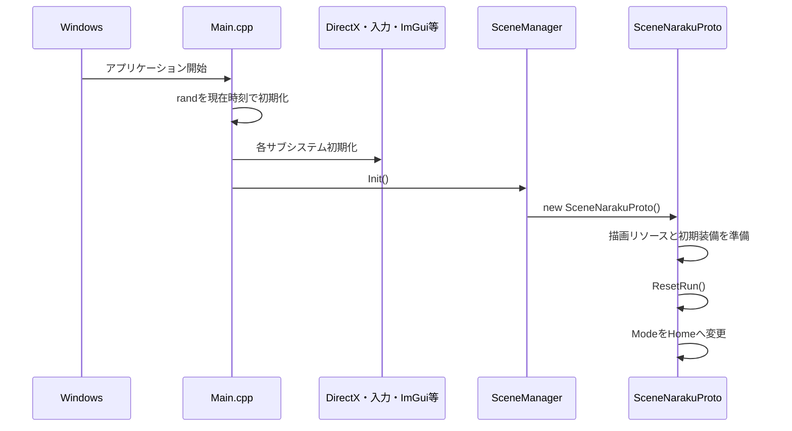

### 8.2 1フレームの更新

`SceneNarakuProto` は `1 / fFPS` を固定の `dt` として使います。

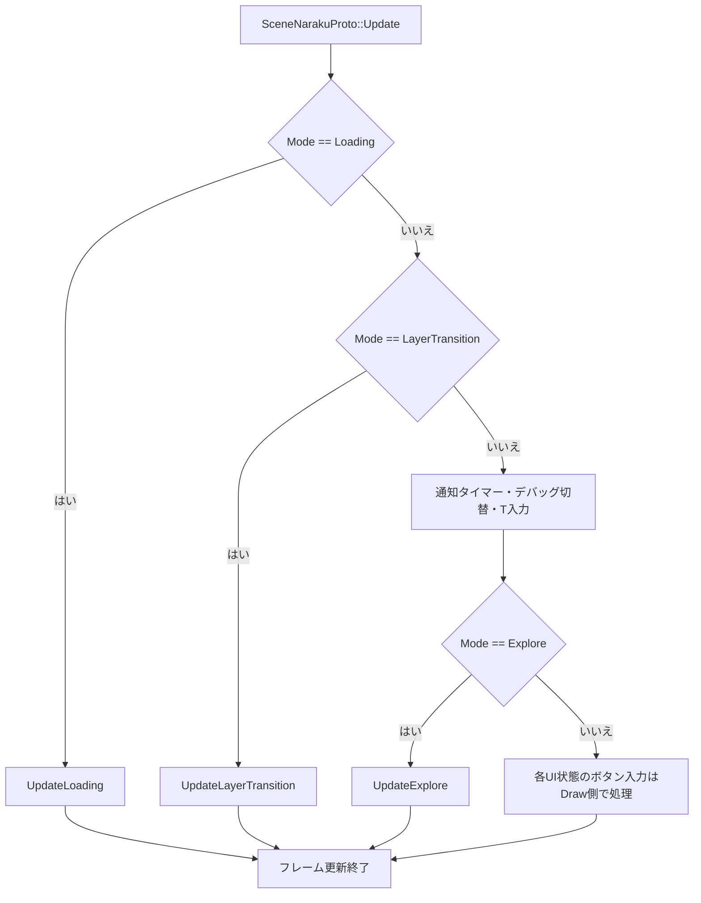

### 8.3 探索更新の順序

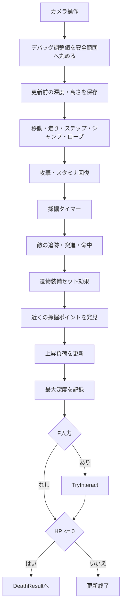

処理順が明示されているため、たとえば移動後の位置を使って採掘発見や上昇負荷を計算することが分かります。

## 9. インタラクトとゲーム状態遷移

`F` キーには帰還、層間口、ロープ、旧器、食料、採掘など複数の操作が集約されています。`TryInteract()` が距離や現在状態を調べ、優先順位に従って1つを実行します。

### 9.1 シーン内モード

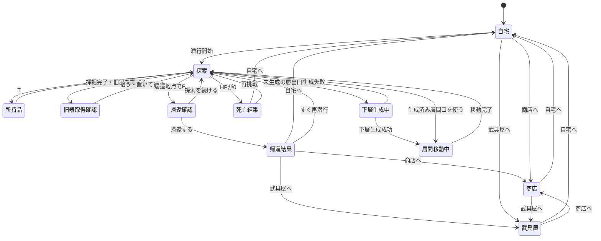

### 9.2 重量による判断

重量は単なる所持上限ではなく、段階的に行動へ影響します。

| 重量率 | 影響 |
| ---: | --- |
| 70%未満 | 通常状態 |
| 70%以上 | 移動速度25%低下 |
| 90%以上 | スタミナ消費2倍 |
| 100%以上 | 走り、ステップ、ジャンプ不可 |
| 通常上限150超 | 新しいアイテムを取得不可 |

通常時の最大重量は100、取得上限は150なので、最大重量の150%までは歩行できます。「多く持つほど帰りにくいが、完全に詰ませない」という設計です。遺物装備のセット効果が有効な場合は最大重量が200になり、取得上限も200へ引き上げられます。

## 10. ピース編集と保存

### 10.1 編集対象

小ステージEditorでは、主に次を編集できます。

- 頂点高低差
- セルの歩行可否・削除・各種配置許可
- 四辺の接続カテゴリ
- ロープ
- 採掘ポイント
- 環境オブジェクト
- 開始・帰還地点候補
- 層入口・層出口

### 10.2 下書き保存と完成保存

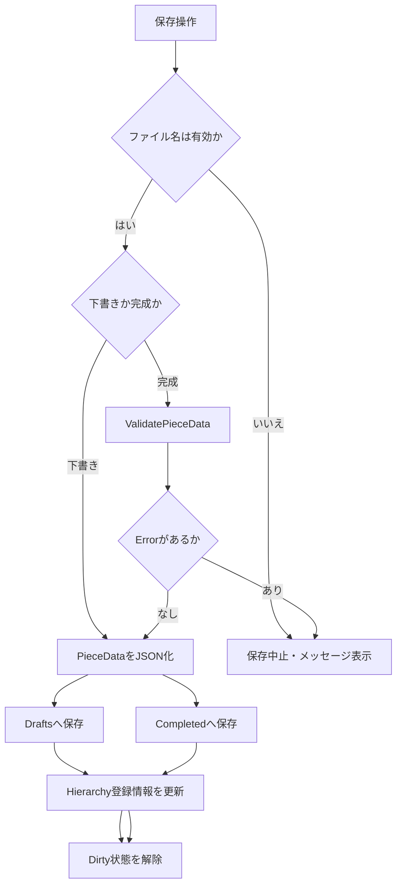

下書きは途中状態を許容します。完成保存は、生成候補として扱ってよい品質かを検証してから保存します。この2段階は、制作途中の自由度と生成データの安全性を両立させるためのものです。

## 11. マップ自動生成

### 11.1 生成の入力と出力

- 入力: `Assets/Naraku/Pieces/Layer1/Completed` 配下の完成ピース
- 出力: `NarakuMap::MapData` と生成済みマップJSON
- 現在の実行用構成: 4x4、合計16ピース
- 接続判定: 各ピースの北・南・東・西の `StageCategory`
- 外周判定: マップ外へ抜ける辺を `Blocked` にする

### 11.2 生成処理

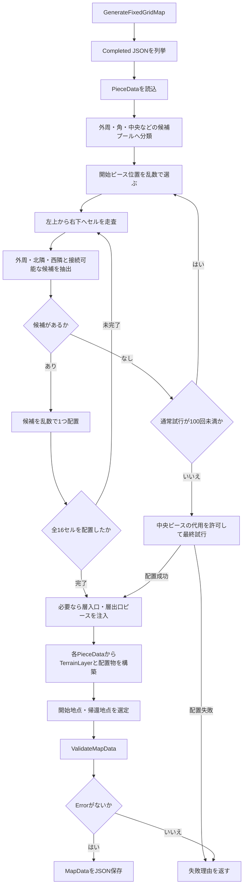

走査順が左上から右下なので、配置時点で確定済みの北隣と西隣だけを調べれば接続を判断できます。東と南は後続セルが合わせます。

### 11.3 乱数

生成器は `std::rand()` を使い、アプリケーション起動時に現在時刻でseedを設定します。同じピース集合でも生成結果は変化します。一方、seedを外部指定・記録する機能はないため、特定の生成不具合を完全再現する仕組みは現在ありません。

## 12. マップ検証

`ValidateMapData` は、次の種類の検証を行います。

- 地形レイヤーの有無
- グリッドサイズ、セルサイズ、配列長
- レイヤーIDの重複
- 開始地点・帰還地点の範囲、歩行可否、危険地形
- ロープの接続レイヤー、位置、アンカー
- 層間口のロープ端点とロード地点
- 環境オブジェクトのID、位置、倍率
- 採掘ポイントの位置、歩行可否、危険地形
- 開始地点から帰還地点までの到達可能性
- 開始地点から到達可能な採掘ポイントの有無

### 12.1 到達可能性

到達判定は、開始地点のセルから幅優先探索を行います。同一レイヤー上の上下左右へ移動し、ロープ接続がある場合は別レイヤーの接続セルも探索対象へ加えます。

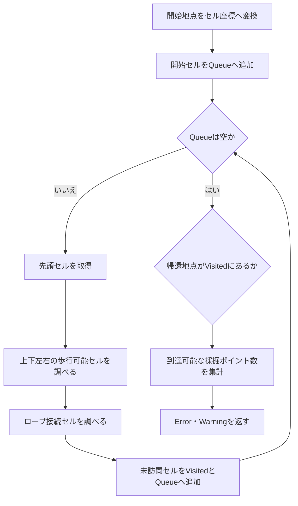

生成結果を「JSONとして読める」だけでなく「ゲームとして帰還可能」に近い水準で検証している点が、この生成パイプラインの重要な安全策です。

## 13. エリア生成と層間移動

### 13.1 `AreaState`

1回の潜行中に生成したエリアは `m_areas` に保持されます。各 `AreaState` は次を持ちます。

- 深度
- `MapData`
- 地上の旧器と食料
- 採掘ポイント
- 敵
- 床領域とロープ
- 層間口
- 地図ピン
- 開始・帰還地点

### 13.2 初回だけ生成する流れ

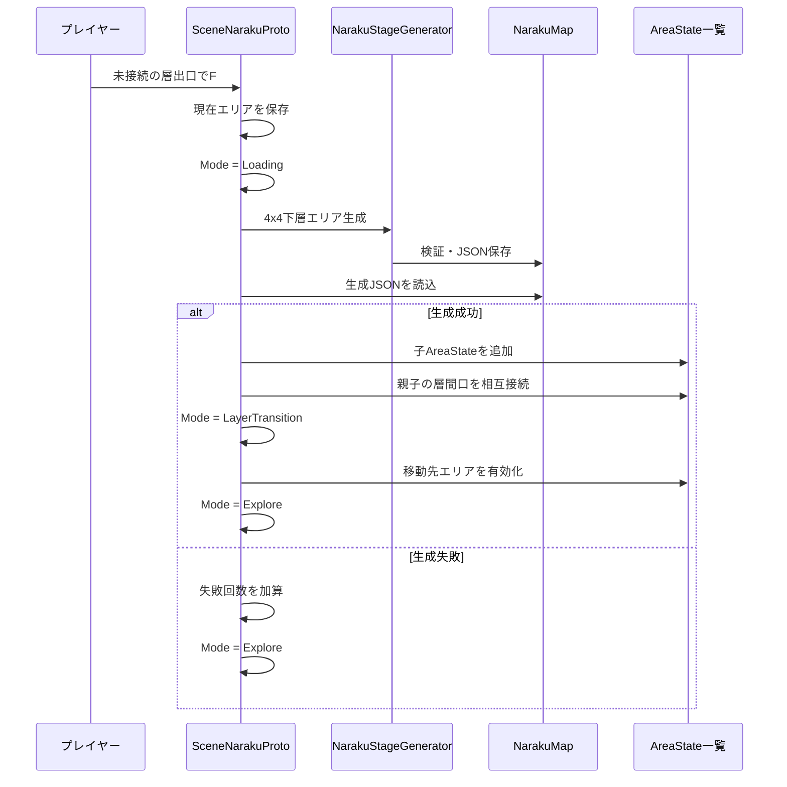

同じ層間口で累計5回生成に失敗すると、その層間口は潜行中使用不能になります。生成済みの接続先がある場合は生成器を呼ばず、保存済み `AreaState` へ移動します。

### 13.3 上昇負荷

層間移動が上昇の場合、移動時間に応じて上昇負荷を加算します。ゲージが規定量へ達すると精神力を減らしてゲージを0へ戻します。通常探索中も、前フレームとの高さ・深度差から上昇量を計算します。

## 14. 描画処理

### 14.1 描画の大きな流れ

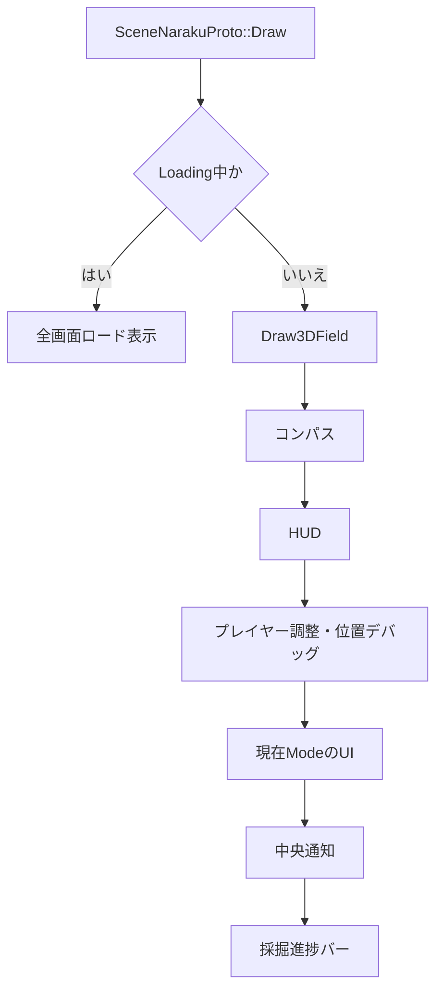

### 14.2 地形床のバッチ

1セルごとに `Draw()` を呼ぶ方式ではなく、表示対象セルの四角形6頂点を `m_terrainFloorVertices` へ並べ、最後に1回の描画へまとめます。

理論上の最大3,600セルでは、床だけを見ればドローコールは最大3,600回から1回へ減ります。これは理論値であり、最終的なFPSやGPU時間の改善量は実機計測が別途必要です。

### 14.3 敵ビルボードのバッチ

各敵についてカメラ正対の6頂点をCPU側で作り、同じテクスチャ・シェーダーを使う敵をまとめて描画します。敵数が増えても、敵本体の描画回数を1回に維持できます。

## 15. エラー処理とフォールバック

### 15.1 初期エリア

`ResetRun()` は4x4マップの生成と読込を最大5回試します。失敗した場合は既存の3x3生成マップ、既定マップ、それも読めない場合は `CreateDefaultMap()` の順に切り替えます。

この仕組みにより生成データが不足してもプロトタイプ起動を継続しやすくなっています。一方、企業レビューでは「生成失敗を表面化せず別マップで続行するため、問題を見逃さないか」という確認対象になります。

### 15.2 下層エリア

下層生成は失敗時に元エリアへ戻り、通知を表示します。初期エリアのような別マップへのフォールバックは行いません。これは、親子接続が不完全な状態で潜行を続けないためです。

### 15.3 Editor

- 読込・保存関数は `bool` とエラー文字列を返します。
- 完成ピースは検証エラーがあると保存しません。
- Undo/Redo履歴は最大64件です。
- 新規編集を始めるとRedo履歴を破棄します。

## 16. 現在の設計の強み

### 16.1 ゲームデザインと技術構造が対応している

「毎回違う奈落へ潜る」という企画を、完成ピースのランダム組み合わせで支えています。また、「同じ潜行中に戻った場所は変わらない」という期待を `AreaState` の保持で実現しています。

### 16.2 制作者向けツールまで同じリポジトリにある

ピースEditor、マップEditor、生成器、ランタイムが同じデータ定義を共有しています。仕様変更時に、編集形式と実行形式の対応を追いやすい構成です。

### 16.3 検証が生成工程へ組み込まれている

人が完成保存する時と、自動生成後の2回検証します。さらに到達可能性まで見るため、目視だけでは見つけにくい「開始できるが帰れないマップ」を検出できます。

### 16.4 プロトタイプ目的に対して実装範囲が明確

既存基盤を再利用し、中心判断、重量、採掘、帰還、ロスト、上昇負荷の検証を優先しています。完成版に必要な全システムを先に作らない方針が、企画草案にも明記されています。

### 16.5 ボトルネックへ具体的な対策を入れている

地形床と敵のバッチ描画は、表示数に比例して増えるドローコールを削減します。最適化理由と理論上の削減量がコードと [最適化.md](最適化.md) に残っています。

## 17. 現在の課題と技術的負債

以下は、プロトタイプとしては許容できても、製品化やチーム開発前に判断が必要な点です。

### 17.1 `SceneNarakuProto` の責務が大きい

1つのクラスが、入力、移動、戦闘、採掘、経済、拠点UI、地図、エリア管理、データ変換、描画、GPUリソース管理まで担当しています。

小規模な検証では追跡しやすい一方、機能追加時は変更箇所が衝突しやすくなります。製品化する場合は、少なくとも次の単位で分離を検討できます。

- 潜行セッションとエリア状態
- プレイヤー移動・戦闘
- インベントリ・経済
- 生成マップからのランタイム構築
- 3D描画
- ImGuiデバッグUI

ただし、分離は現在の要求ではなく、製品化範囲が決まった後に行うべきです。

### 17.2 EditorもUIとドメイン処理を同じクラスに持つ

両Editorは、ImGui描画、入力、選択、検証表示、保存、履歴をまとめています。UIテストやロジック単体テストを行うには分離が必要です。

### 17.3 自動テストがない

専用のテストプロジェクトやCIは確認できません。特に次は自動化の価値が高い部分です。

- JSON保存後に再読込して同じデータになるか
- ピースの各検証条件
- 接続カテゴリの組み合わせ
- 生成マップの到達可能性
- 重量境界の70%、90%、100%、150%
- 帰還と死亡時の所持品移動

### 17.4 生成を再現するseedがない

現在時刻で乱数を初期化するため、問題が起きた生成結果の再現が難しい状態です。企業レビューでは、seedの保存、画面表示、指定再実行をどの段階で入れるかが論点になります。

### 17.5 プロジェクトルートが固定されている

`NarakuPieceData.cpp`、`NarakuMapData.cpp`、`SceneNarakuPieceEditor.cpp` に、この開発環境の絶対パスが定数としてあります。別PCや別配置でEditorのファイル解決が正しく動くか、移植前に確認と修正が必要です。

### 17.6 JSON処理が重複している

ピース用とマップ用の `.cpp` に、それぞれ独自の最小JSONパーサと出力処理があります。

- 不具合修正を両方へ反映する必要がある
- JSON仕様の対応範囲が一般ライブラリより限定される
- スキーマ変更時の負担が大きい

外部依存を増やさない利点はありますが、製品化時は共通化または既存JSONライブラリ採用の比較が必要です。

### 17.7 ファイルバージョンの互換方針が未完成

- ピースJSONは `version` を読み込みますが、未対応バージョンの拒否や移行処理はありません。
- マップJSONはversion 2を書き出しますが、読込時にversionを使った分岐がありません。

形式変更時に古いデータをどう扱うか、破棄、移行、互換読込の方針を決める必要があります。

### 17.8 固定時間刻み

ゲーム更新は実測フレーム時間ではなく `1 / fFPS` を使っています。メインループが常に想定周期で動く前提なら単純ですが、処理落ちや可変リフレッシュ環境で実時間とゲーム時間がずれる可能性があります。

### 17.9 所有権管理が手動

シーン、シェーダー、メッシュ、テクスチャ、モデルなどに `new`、`delete`、`SAFE_DELETE` を使っています。既存基盤との整合性はありますが、例外や途中失敗を含む所有権の確認負担があります。

### 17.10 理論値と実測値を分ける必要がある

バッチ化によるドローコール削減はコードから確認できますが、最終的なFPS、CPU時間、GPU時間、メモリ使用量は環境依存です。企業へ説明する際は「理論上の命令削減」と「実機計測結果」を区別する必要があります。

### 17.11 永続化されない進行状態

所持金、装備、保管品、鑑定状態などはシーンのメモリ上にあります。アプリケーション終了後へ引き継ぐセーブデータはプロトタイプ範囲外です。

## 18. 現在採用していない、または限定的な設計

### MVC / MVVM

Editorもランタイムも、状態、処理、ImGui表示が同じシーンクラスにあります。厳密なMVCやMVVMではありません。

### Entity Component System

プレイヤー、敵、採掘ポイントなどは用途別の構造体と配列で管理しています。汎用ECSは使っていません。現在の規模では明示的で理解しやすい一方、種類と共通挙動が大幅に増える場合は再検討対象になります。

### Dependency Injection

入力、描画、ファイル、乱数などはグローバル関数、static管理、直接生成を通して使います。依存を差し替える仕組みはなく、単体テストの難しさにつながっています。

### Commandパターン

Undo/Redoは各操作をCommandとして記録せず、状態全体のSnapshotを保存します。実装は単純ですが、データ量が増えると履歴メモリも増えます。

## 19. 企業レビューで説明すべき設計判断

### 「なぜ独自Editorを作ったのか」

ランダム生成へ投入するデータには、地形だけでなく接続カテゴリ、配置許可、層間口、開始地点などのゲーム固有情報が必要だからです。汎用3Dツールだけでは、この整合性検証とJSON出力までを一体化しにくいためです。

### 「なぜピースとマップを別形式にしたのか」

ピースは再利用する制作単位、マップはゲームが消費する統合結果で、役割が異なるからです。同じ形式にすると、ローカルセル座標とワールド座標、接続情報と実配置情報が混在します。

### 「なぜ状態クラスへ完全分割していないのか」

現在はゲームルールの変更頻度が高いプロトタイプで、処理を1か所から追えることを優先したためです。ただし、状態列挙と更新分岐は明示しており、製品化時に分離する境界は見えています。

### 「なぜ生成後にも検証するのか」

個々のピースが正しくても、組み合わせた結果として帰還不能、ロープ不整合、配置物の範囲外が発生し得るためです。部品検証と完成物検証は別の責務です。

### 「なぜ生成済みエリアを保持するのか」

再訪時に敵、採掘、ドロップ、ピンが元へ戻ると、プレイヤーの行動結果が失われるからです。潜行中だけ状態を保持し、次回潜行では再生成することでローグライトの周回性と整合させています。

### 「最適化は何を根拠に行ったのか」

セル数に比例していた描画命令とバッファ更新を、同一シェーダー・同一描画形式ごとにまとめています。まず明確に増加するCPU側命令数を減らしたもので、最終性能評価には実機プロファイルを追加する必要があります。

## 20. 今後の改善優先順位

製品化へ進む場合は、次の順序が妥当です。

1. 生成seedの記録と指定再現を追加し、生成不具合を追跡可能にする。
2. `PieceData`、`MapData`、生成器、重量計算の自動テストを追加する。
3. 固定絶対パスを実行位置または設定から解決する。
4. JSONのバージョン互換方針を決める。
5. 実機でCPU・GPU・メモリを計測する。
6. 製品版の必要範囲に合わせて `SceneNarakuProto` の責務を分離する。
7. セーブデータ、コントローラー、第二層以降など、企画上の次機能へ進む。

この順序は、先に再現性と検証可能性を確保し、その後で大きな構造変更や機能追加を安全に行うためのものです。

## 21. 主要コード参照

| 確認したい内容 | ファイル |
| --- | --- |
| シーン共通API | [`DX22_Project/Scene.h`](DX22_Project/Scene.h) |
| シーン生成と切替 | [`DX22_Project/SceneManager.cpp`](DX22_Project/SceneManager.cpp) |
| ゲーム全体 | [`DX22_Project/SceneNarakuProto.cpp`](DX22_Project/SceneNarakuProto.cpp) |
| ゲーム状態・データ構造 | [`DX22_Project/SceneNarakuProto.h`](DX22_Project/SceneNarakuProto.h) |
| 小ステージEditor | [`DX22_Project/SceneNarakuPieceEditor.cpp`](DX22_Project/SceneNarakuPieceEditor.cpp) |
| 統合マップEditor | [`DX22_Project/SceneNarakuEditor.cpp`](DX22_Project/SceneNarakuEditor.cpp) |
| ピースデータと検証 | [`DX22_Project/NarakuPieceData.cpp`](DX22_Project/NarakuPieceData.cpp) |
| マップデータと到達検証 | [`DX22_Project/NarakuMapData.cpp`](DX22_Project/NarakuMapData.cpp) |
| 4x4マップ生成 | [`DX22_Project/NarakuStageGenerator.cpp`](DX22_Project/NarakuStageGenerator.cpp) |
| ビルド設定 | [`DX22_Project/DX22_Project.vcxproj`](DX22_Project/DX22_Project.vcxproj) |

## 22. まとめ

このプロジェクトは、既存DirectX基盤へ奈落塔固有のゲームシーンと制作ツールを追加し、次の一連の流れを実装したプロトタイプです。

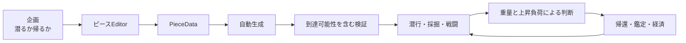

設計上の中心は、独立シーンによる既存基盤との分離、JSONによるデータ駆動、2段階の検証、状態機械、生成済みエリアの保持、バッチ描画です。

一方、主要シーンクラスへの責務集中、自動テストと生成再現性の不足、固定パス、JSON互換方針などは、チーム開発・製品化へ進む前の主要課題です。現状は「ゲームの中心判断が面白いかを検証するプロトタイプ」として意図が通った構成であり、次段階では再現性と検証基盤を先に強化することが重要です。
